# Desafio Embrapii

## Carta 1

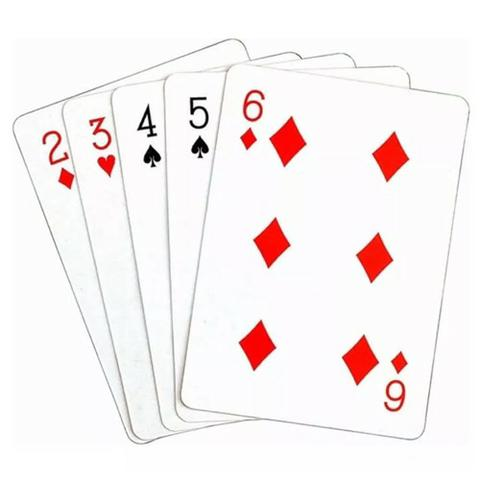

### Dimensão

480 x 480

### Distribuição de Cores

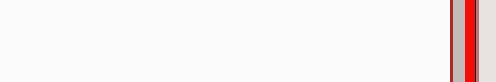

### Filtros Úteis

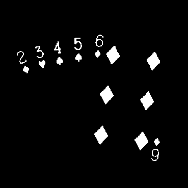
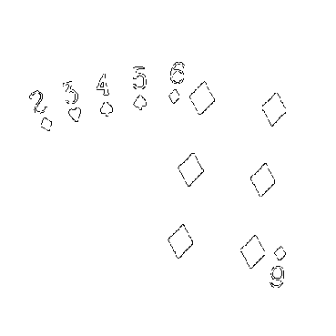

### Outras observações

- Cartas em sequência de 2 a 6, inclusive
- 3 naipes diferentes

---

## Carta 2

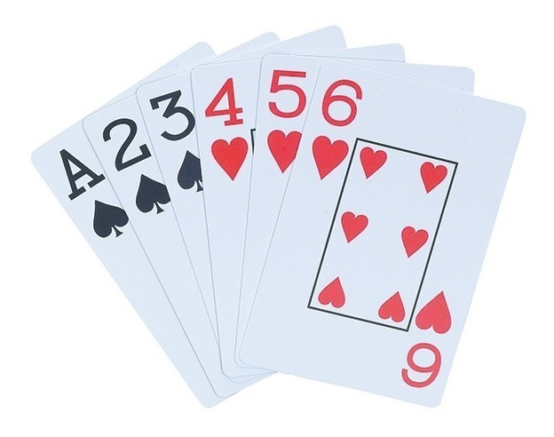

### Dimensão

480 x 480

### Distribuição de Cores

### Filtros Úteis

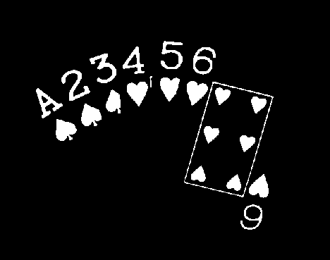
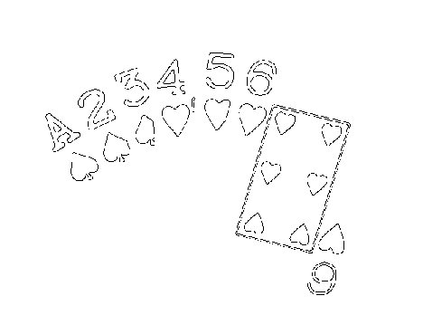

### Outras observações

- Cartas em sequência crescente de A a 6, inclusive
- As cartas são dividas igualmente entre 2 naipes
- 2 naipes diferentes com cores diferentes
- Os naipes são semelhantes se espelhados no eixo x

---

## Carta 3

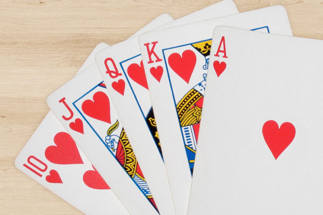

### Dimensão

480 x 480

### Distribuição de Cores

### Filtros Úteis

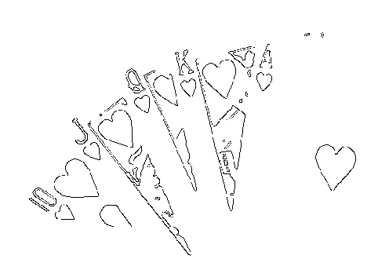

### Outras observações

- Cartas em sequência crescente de 10 a A, inclusive
- Todas do mesmo naipe
- Somente as 2 das pontas não possuem uma imagem (desenho)
- Somente as 3 cartas do meio possuem a cor amarela

---

## Carta 4

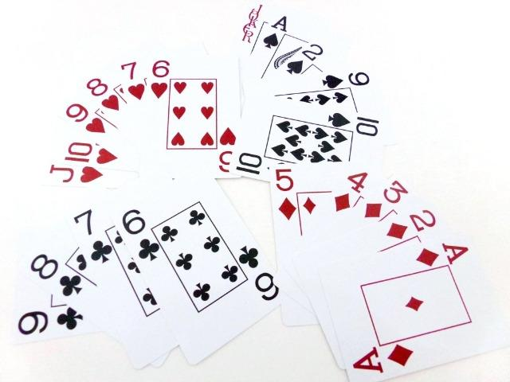

### Dimensão

480 x 480

### Distribuição de Cores

### Filtros Úteis

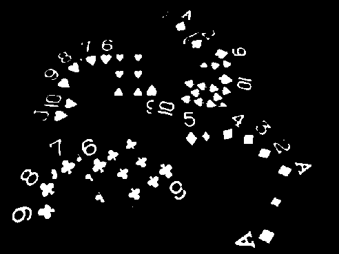
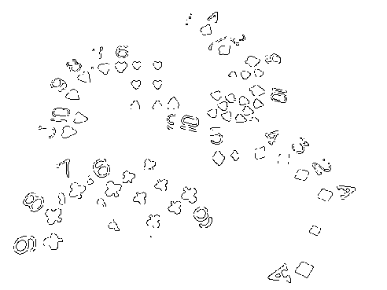

### Outras observações

- 4 conjunto de cartas, cada um com um naipe específico
- Cores distribuídas em forma de X
- NAIPE PAUS
    - Cartas em sequência decrescente de 9 a 6, inclusive
    - 4 cartas
- NAIPE OUROS
    - Cartas em sequência decrescente de 5 a A, inclusive
    - 5 cartas
- NAIPE COPAS
    - Cartas em sequência decrescente de J a 6, inclusive
    - 6 cartas
- NAIPE ESPADAS
    - 4 cartas
    - diferença entre o valor das cartas 2 a 2 é 1
        (2 - A) = (10 - 9) = 1
- As cartas de OUROS podem ser concatenadas tanto com as de PAUS 
    quanto as de COPAS formando sequências maiores
    - OUROS U PAUS = [9, 8, ..., 2, A]
    - OUROS U COPAS = [J, 10, ..., 2, A]

---

## Carta 5

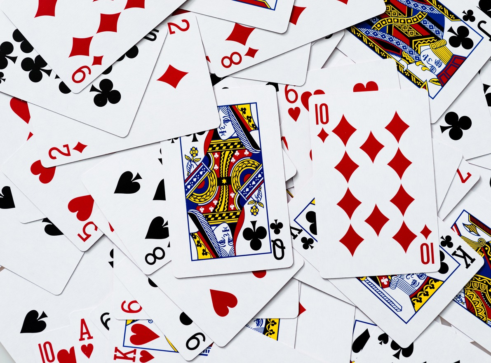

### Dimensão

480 x 480

### Distribuição de Cores

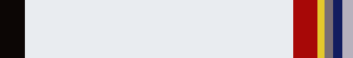

### Filtros Úteis

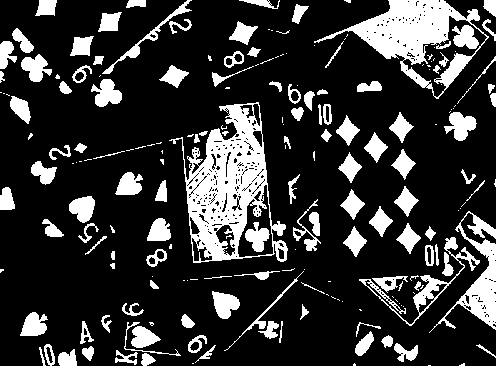
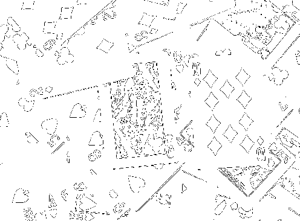

## Comentários

- Os filtros aplicados não foram utilizados de qualquer maneira significativa
    pois implementação de algoritmos levariam algum tempo. Utilizando os mesmos
    poderia ser possível identificar por exemplo a quantidade de cartas de um
    determinado naipe, assim como as cartas de forma individual.
- Os filtros utilizados foram blur + threshold e detecção de bordas (canny)
- A barra de cores frequentes apresenta as 7 cores mais frequentes
- Tive dificuldade em reconhecer algum padrão ou em extrair alguma informação
    na 5 (o filtro de bordas não seria de muita ajuda nesse caso específico).
